[Japanese](README_ja.md)

# Analysis of House Music Composition

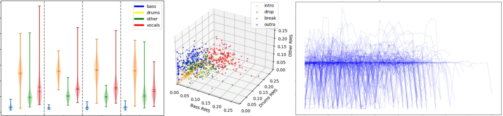

## Overview

This project is an environment for conducting analysis with the aim of uncovering the determining factors and patterns in the composition of house music. The related research paper for this project can be found [here](https://github.com/Jtwulf/papers).

## Repository Structure

```
.
├── Dockerfile          # For Omnizart
├── docker-compose.yml  # For Omnizart
├── requirements.txt    # Required libraries for Python programs
├── NATTEN/             # Models required for All-In-One usage
├── data/               # Experimental data
├── images/             # Experimental results
├── notebook/           # Jupyter notebook environment for experimental programs
└── src/                # Experimental programs
    └── scripts/        # Various scripts
```

`data/` contains only a partial public dataset due to copyright restrictions.

## Prerequisites

To run the programs in `src/`, you need to install the required libraries:


Alternatively, programs with the same content as `src/` can be found in `notebook/experiments.ipynb`.

You need to place experimental data in the `data/` directory.

In this project, the composition of a house music track is defined into the following four sections:

| Section | Description                    |
|---------|--------------------------------|
| Intro   | Introduction part of the track |
| Drop    | Climax part of the track       |
| Break   | Part other than the climax     |
| Outro   | Conclusion part of the track   |

## Description of Each Program

### experiment1

Analysis of the relationship between each section and frequency feature (Spectral Centroid).

#### Program Flow

1. Retrieve segmentation information of music using All-In-One.
2. Extract frequency feature (Spectral Centroid) from the music.
3. Visualize the average frequency feature values for each section based on segmentation information.

#### Results

<p float="left">
  
  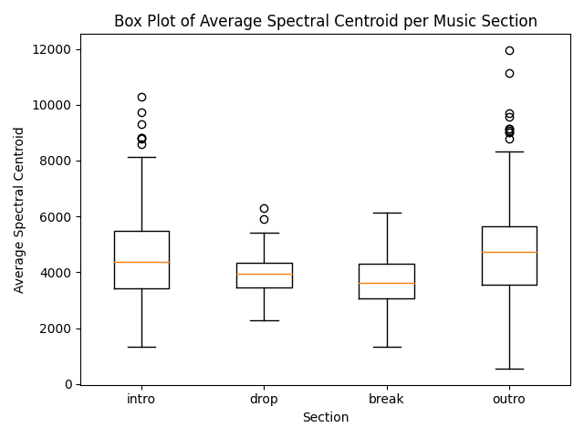 
  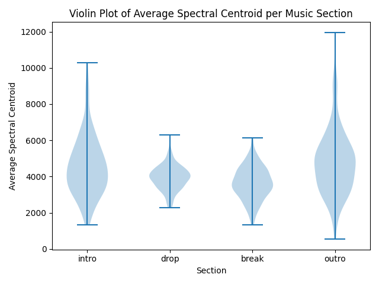
</p>

___

### experiment2

Analysis of the relationship between each section and frequency feature (Spectral Centroid) for each part of the music.

#### Program Flow

1. Retrieve segmentation information of music using All-In-One.
2. Perform source separation of the music into 4 parts (drums, bass, other, vocals) using Demucs.
3. Exclude source intervals where RMS falls below a threshold.
4. Extract frequency feature (Spectral Centroid) from the music.
5. Visualize the average frequency feature values for each section and each part based on segmentation information.

#### Results

<p float="left">
  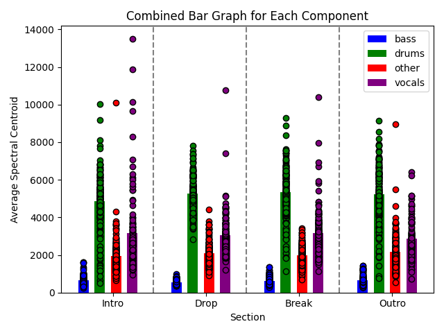
  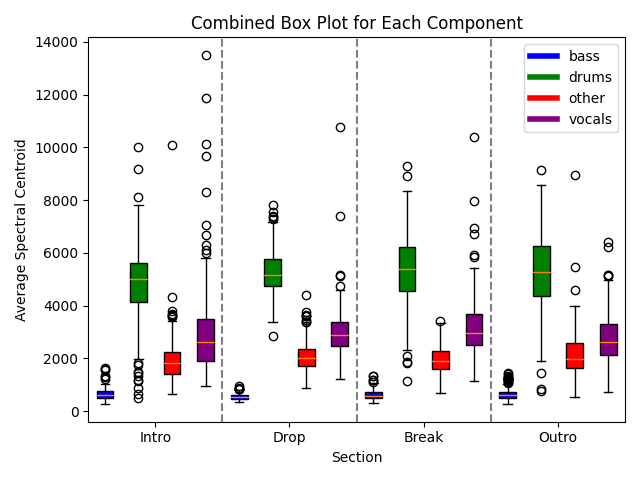 
  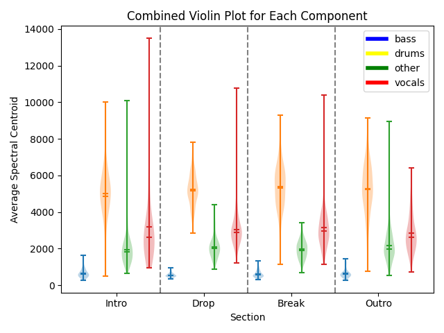
</p>

___

### experiment2ex

Investigation of effective durations for each part in experiment2.

#### Program Flow

1. Retrieve segmentation information of music using All-In-One.
2. Perform source separation of the music into 4 parts (drums, bass, other, vocals) using Demucs.
3. Calculate the length (effective duration) of source intervals where RMS exceeds a threshold.
4. Visualize the effective duration for each section and each part.

#### Results

<p float="left">
  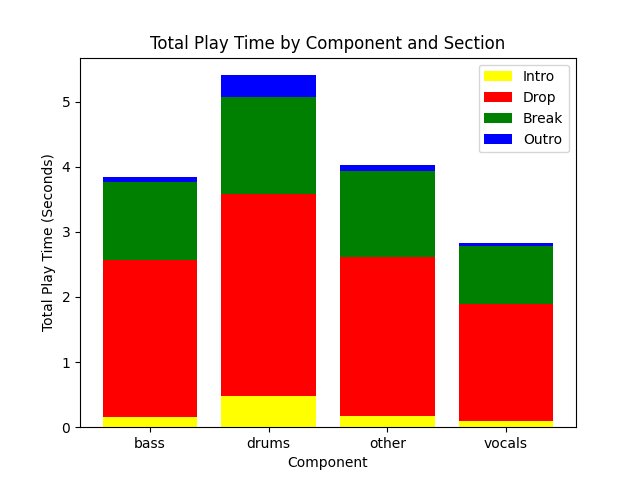
</p>

___

### experiment2ex2

Analysis of the relationship between each section and sound pressure feature (RMS) for each part of the music.

#### Program Flow

1. Retrieve segmentation information of music using All-In-One.
2. Perform source separation of the music into 4 parts (drums, bass, other, vocals) using Demucs.
3. Extract sound pressure feature (RMS) from the music.
4. Visualize the average sound pressure feature values for each section and each part based on segmentation information.

#### Results

<p float="left">
  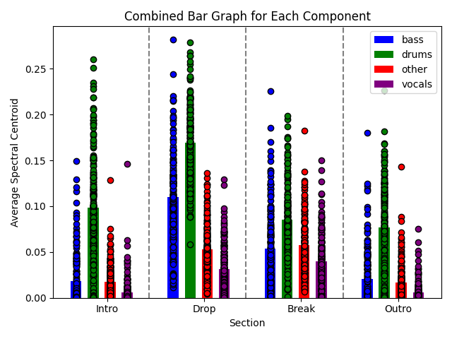
  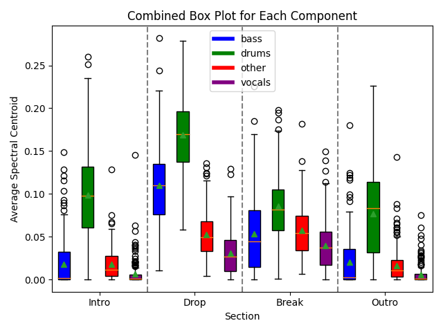
  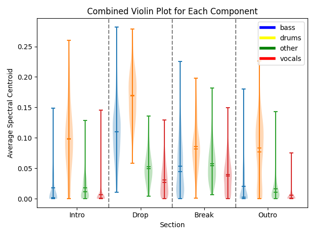
</p>

___

### experiment3

Analysis of the sound pressure balance trends for each part in each section.

#### Program Flow

1. Retrieve segmentation information of music using All-In-One.
2. Perform source separation of the music into 3 parts (drums, bass, other+vocals) using Demucs.
3. Extract sound pressure feature (RMS) from the music.
4. Plot the sound pressure feature balance for each section in a 3D space.

#### Results

<p float="left">
  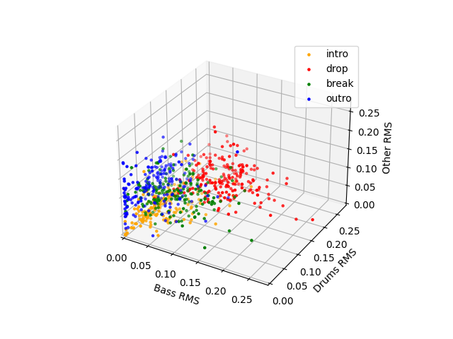
</p>

___

### experiment4

Analysis of the trends in drum elements for each section.

#### Program Flow

1. Use Omnizart to extract drum MIDI from audio sources.
2. Aggregate the number of various drum elements for each section and visualize them.

#### Results

<p float="left">
  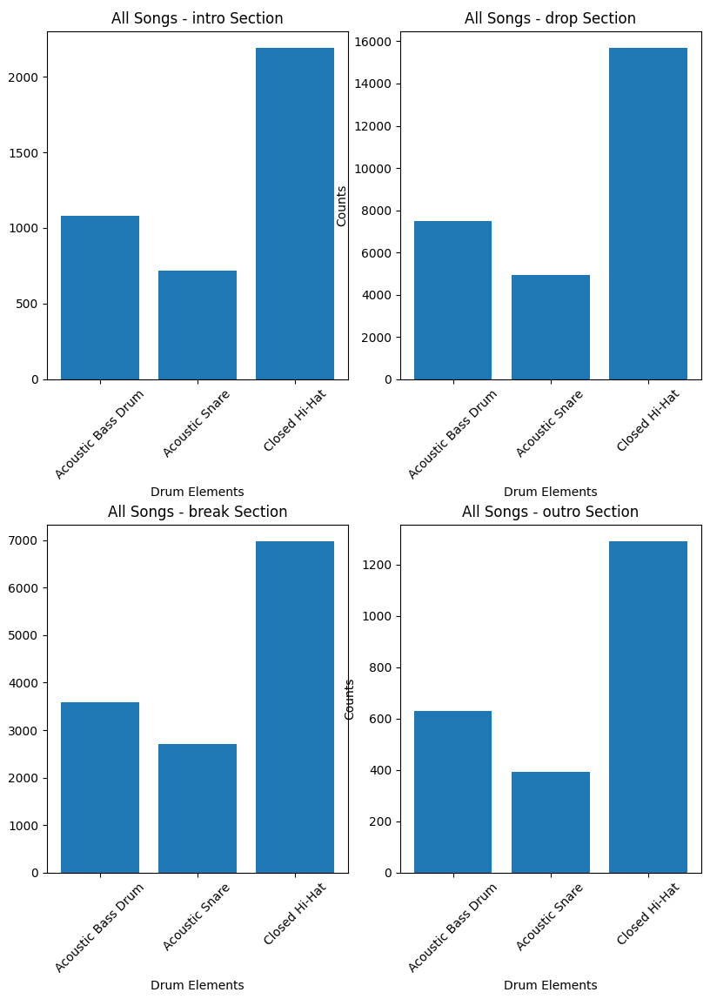
</p>

___

### experiment4ex

Analysis of the trends in the timing of drum element activations for each section.

#### Program Flow

1. Use Omnizart to extract drum MIDI from audio sources.
2. Aggregate the number and timing of various drum elements for each section.
3. Visualize the timing of drum element activations as spaghetti plots.

#### Results

<p float="left">
  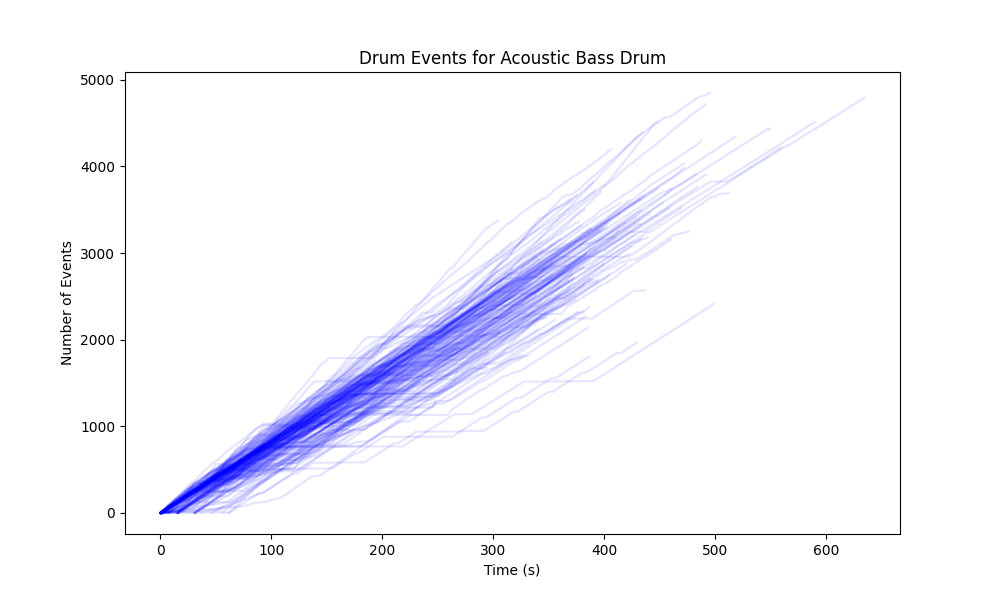
  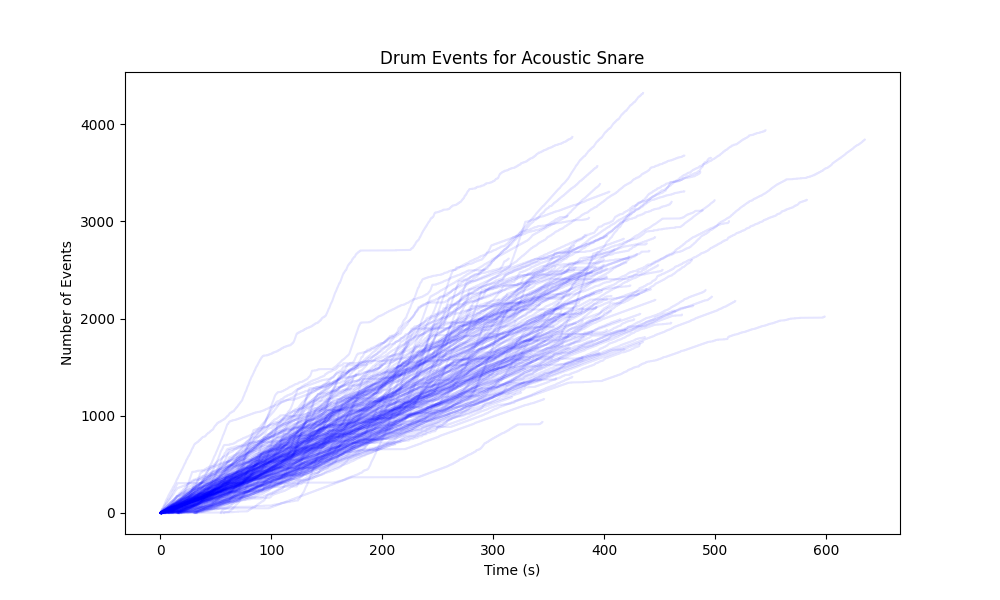
  
</p>

___

### experiment4ex2

Analysis of the trends in the timing of drum element activations for each section.

#### Program Flow

1. Use Omnizart to extract drum MIDI from audio sources.
2. Calculate the length of 8 bars of the music using All-In-One's tempo estimation results.
3. Aggregate the number of various drum elements for each section in 8-bar segments.
4. Visualize the number of drum elements in 8-bar segments as spaghetti plots.

#### Results

<p float="left">
  
  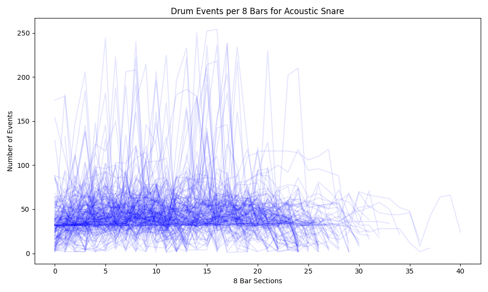
  
</p>

___

### experiment5

Analysis of the correlation between drum pattern changes and section changes.

#### Program Flow

1. Use Omnizart to extract drum MIDI from audio sources.
2. Retrieve section change timings from All-In-One's segmentation information.
3. Detect drum pattern changes by measuring the lengths between all drum events in MIDI and using the standard deviation as a threshold.
4. Calculate the coincidence rate between drum pattern change timings and section change timings for cases where each is the denominator.
5. Visualize the coincidence rate.

#### Results

Probability with drum pattern changes as the denominator:

<p float="left">
  
  
</p>

Probability with section changes as the denominator:

<p float="left">
  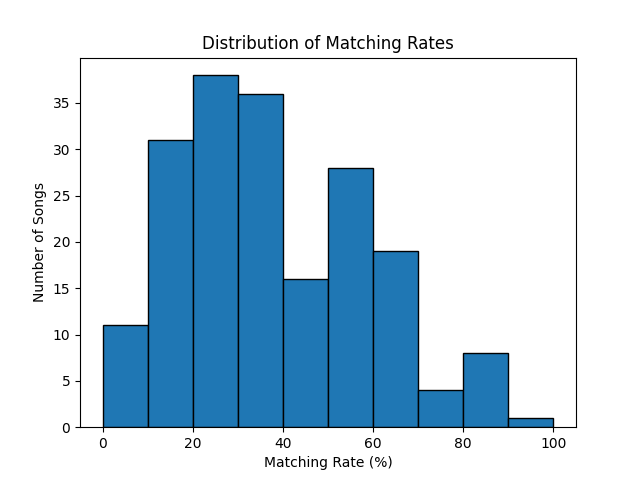
  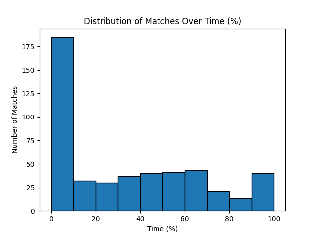
</p>

## Related (Webs of Interest)

- [All-In-One](https://github.com/mir-aidj/all-in-one)
- [Demucs](https://github.com/facebookresearch/demucs)
- [Omnizart](https://github.com/Music-and-Culture-Technology-Lab/omnizart)

## Authors

Justin Wulf - wulf@kthrlab.jp
